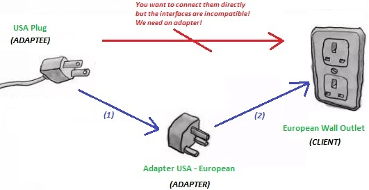
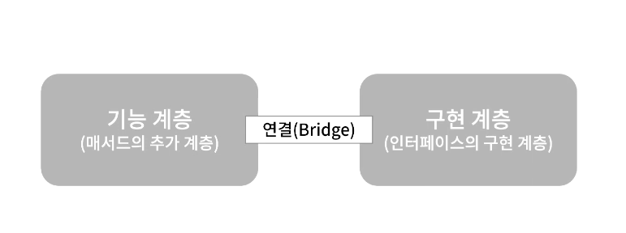
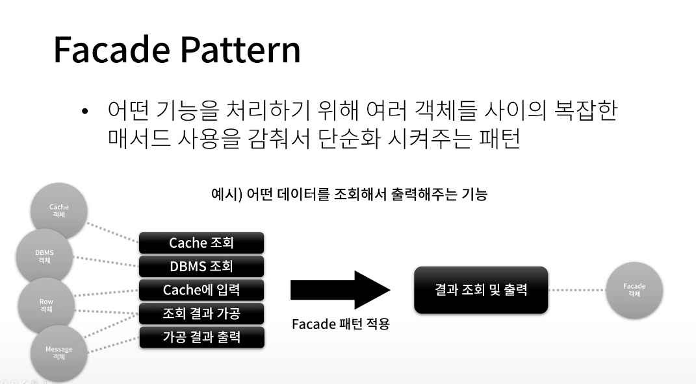

<!-- TOC -->
* [Gof Design Pattern](#gof-design-pattern)
  * [디자인 패턴이란?](#-)
    * [올바른 관계를 맺어야 하는 이유?](#----)
  * [1. Iterator](#1-iterator)
  * [2. Strategy](#2-strategy)
  * [3. Template](#3-template)
  * [4. Adapter](#4-adapter)
  * [5. Bridge](#5-bridge)
  * [7. Singleton](#7-singleton)
  * [11. Observer](#11-observer)
  * [14. Proxy](#14-proxy)
  * [17. Facade](#17-facade)
  * [18. Builder](#18-builder)
<!-- TOC -->
# Gof Design Pattern
> Gof
> Gang of Four(4명의 선배 개발자)가 체계적으로 정리해 놓은 설계 방법

## 디자인 패턴이란?
- 소프트웨어 설계 방법
- 반복되는 패턴처럼 자주 나타나는 클래스 간의 관계를 맺는 방법

### 올바른 관계를 맺어야 하는 이유?
1. **클래스는 최소한의 단위 기능을 가짐**
2. 큰 기능을 이러한 단위 기능을 갖는 클래스들 간의 관계를 통해 개발됨
3. 꼭 필요한 것들만으로 구성된 최적화된 소프트웨어 개발이 용이함
4. 문제 발생 시 최소한의 코드 수정으로 유지보수가 용이함
5. 기존 기능에 영향을 주지 않고 새로운 기능 추가가 용이함

## 1. Iterator
- 반복자 패턴
- 동일한 형태의 데이터 형태를 여러개 가지고 있는 것을 Container / Aggregator 라고 한다.
- Array, Linked List, Tree, Graph, Table(DBMS) 
- Aggregator의 구성 데이터를 얻는 방법이 Aggregator 종류에 따라 다르기 때문에 통일된 하나의 방법으로 구성 데이터를 가져오기 위한 패턴

## 2. Strategy
- 필요할 시 전략을 바꿀 수 있는 패턴
- 어떤 하나의 기능을 구상하는 특정하는 부분을 실행중에 다른 것으로 효과적으로 변경할 수 있다.

## 3. Template 
- 단계1 + 단계2 + 단계3 순서로 실행되는 기능
    (각 단계에 대한 구체적인 코드 구현은 없음)

## 4. Adapter
- 변경할 수 없는 클래스를 원하는 형태의 인터페이스나 클래스로 사용하고자 할 때 사용한다.
  

## 5. Bridge
- 기능 계층과 구현 계층의 분리로 시스템의 확장성과 유지보수성을 높이는 패턴
  

## 7. Singleton
- 하나의 클래스 타입에 대해서 오직 하나의 객체만을 보장해주는 패턴

## 11. Observer
- 어떤 상태가 변경됐을 때 이 변화에 관심이 있는 관찰자들에게 알려주는 패턴

## 14. Proxy
- Proxy : 대리인
- 어떤 작업의 실행을 대리인을 통해 실행하도록 하는 패턴

## 17. Facade 
- 어떤 기능을 처리하기 위해 여러 객체들 사이의 복잡한 메서드 사용을 감춰서 단순화 시켜준 패턴
- 다른 개발자들에게 라이브러리를 제공할 때 사용할 수 있다.

## 18. Builder
- 복잡한 구성의 객체를 효과적으로 하는 패턴
- 생성시 지정해야 할 인자가 많을 때 사용하는 패턴
- 객체 생성 시 여러 단계를 순차적으로 거칠 때, 이 단계의 순서를 결정해 두고 각 단계를 다양하게 구현할 수 있도록 하는 패턴

